    Installatiestappen webserver en IDE

# Inhoud

- [Download](#Download)
- [Jetbrains Account](#jetbrains-account)
- [Installatie](#installatie)
    - [GIT](#git)
    - [Laravel Herd](#installatie-laravel-herd)
        - [Configuratie Herd](#configuratie-herd)
    - [Jetbrains Toolbox](#jetbrains-toolbox)
    - [PHPStorm](#phpstorm)
        - [AI assistant](#ai-assistant)
    - [DBngin](#dbngin)
        - [Database toevoegen](#databaseserver-toevoegen)
        - [PHPMyAdmin toevoegen](#phpmyadmin-toevoegen)
- [PHP Projecten](#php-projecten)
    - [Lesopdrachten](#lesopdrachten)
    - [Werkmap](#werkmap)
    - [Eindopdracht](#eindopdracht)
- [[OPTIONEEL] GitHub Student Developer Pack](#OPTIONEEL-github-student-developer-pack)
    - [Domeinnaam](#domeinnaam)
    - [Cloud Hosting](#cloud-hosting)

--------------------

# Download

Download de volgende pakketten maar installeer deze nog **NIET**. De installatie volgt stap voor stap in deze
handleiding.

- Download [Laravel Herd](https://herd.laravel.com/) (de Pro versie is niet nodig)
- Download en installeer de [Jetbrains Toolbox](https://www.jetbrains.com/toolbox-app/)
- Download [DBngin](https://dbngin.com/)
- Download [GIT](https://git-scm.com/downloads) (Gebruik je een Mac? [Lees dan eerst het hoofdstuk hierover.](#git))

--------------------

# Jetbrains Account

Jetbrains biedt studenten de mogelijkheid, zolang je studeert, om gratis gebruik te maken
van hun software. Hiervoor moet je een account aanmaken op de
[Jetbrains website](https://www.jetbrains.com/shop/eform/students). Gebruik hiervoor je e-mailadres
van de Hogeschool Rotterdam.

--------------------

# Installatie

## GIT

### Mac
- De meeste Macs hebben GIT al geïnstalleerd. Open Terminal en typ `git --version`.
  Als je een versienummer ziet, is GIT al geïnstalleerd en kan je deze stap overslaan.
  Zo niet, dan kun je GIT installeren via de [GIT website](https://git-scm.com/download/mac). Ik zou de Homebrew optie
  aanraden. Dit zal je op de Mac later ook nog nodig hebben.

### Windows
- Dubbelklik de installer en volg de stappen. Laat alle settings staan zoals ze staan behalve:
- Bij **select components** vink je de optie _Add a Git Bash Profile to Windows Terminal_

  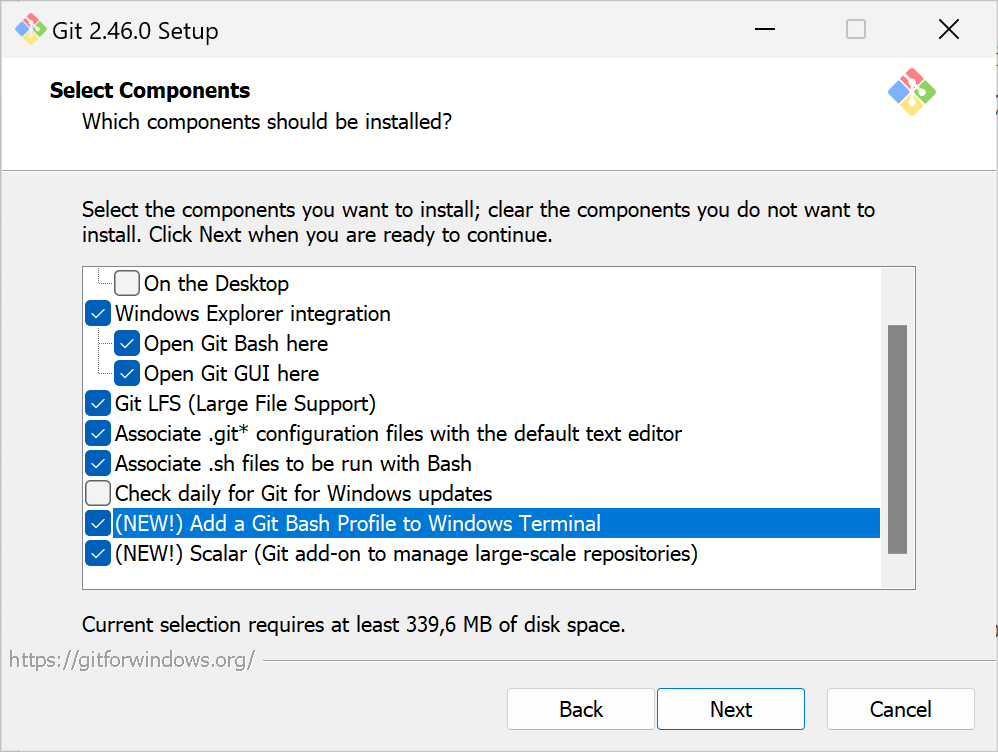
- Bij het scherm **Adjusting the name of the initial branch in new repositories** kies je voor _main_

  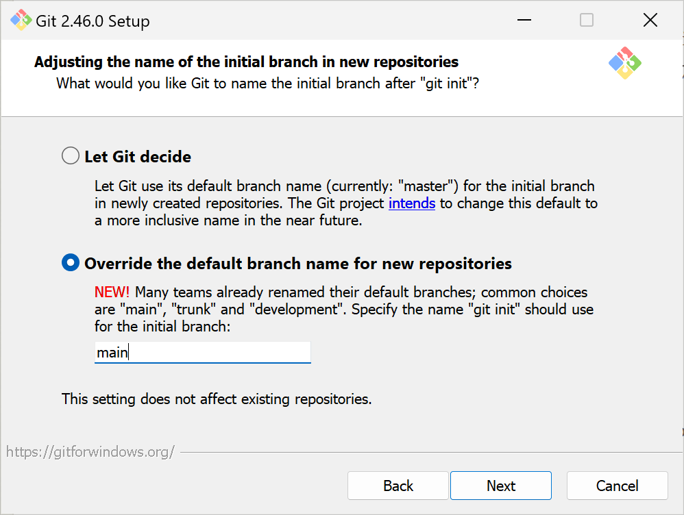

## Development map toevoegen

In deze stap ga je een **Development** map aanmaken waar alle PHP-projecten in komen te staan. Elke map die je
in de Development map aanmaakt, wordt automatisch toegevoegd aan de webserver als site. Deze is dan te openen
in de browser via de naam van de map met `.test` erachter.

_Hiervoor kies je een locatie op je harde schijf welke **buiten** je OneDrive of Google Drive map ligt. Dit is belangrijk omdat deze mappen synchroniseren met de cloud wat vervelend kan zijn als het om veel bestanden gaat. Ook kan het problemen geven met de rechten van de bestanden. Om toch een backup te hebben van de projecten is het verstandig deze toe te voegen aan GIT en te uploaden naar GitHub._


- Kies nu een locatie op je harde schijf welke buiten je OneDrive of Google Drive map ligt.
- Maak de Development map aan.
    - [WINDOWS] `C:\Users\[USER ACCOUNT]\Development`.
    - [MAC] `~/Development` of `Users/[USER ACCOUNT]/Development`.

## Installatie Laravel Herd

- Start en doorloop de installer van [Laravel Herd](https://herd.laravel.com/).
- [MAC] Geef permissie voor nginx en dnsmasq. En skip Herd Pro
  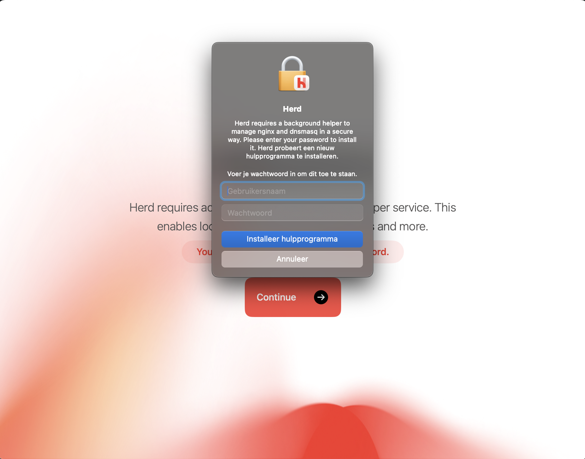
- Gebruik niet de default folder maar kies de eerder aangemaakte **Development** folder.
  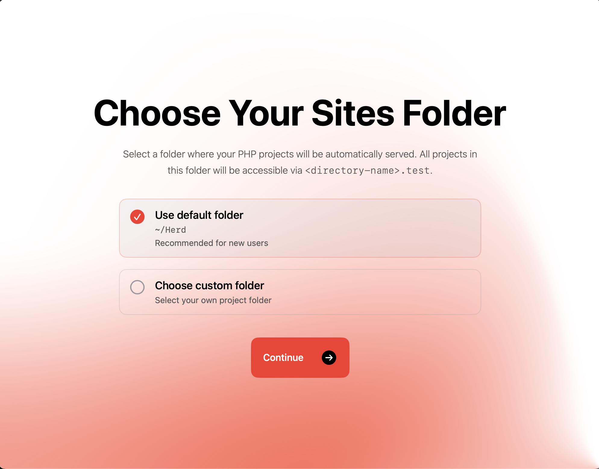

- Als laatste stap heb je de mogelijkheid om de installatie te voltooien.
    - [WINDOWS] Vink de twee opties aan
        - _Automatically launch Herd on system startup_
        - _Launch Herd minimized as system tray application_

          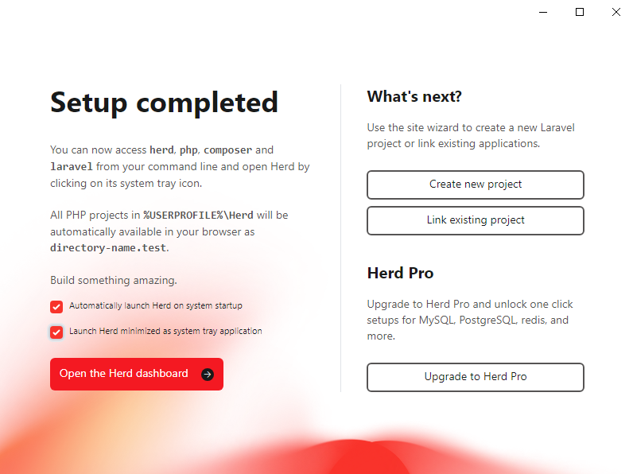
    - [MAC] Vink de optie aan.
        - _Launch Herd on system startup_

          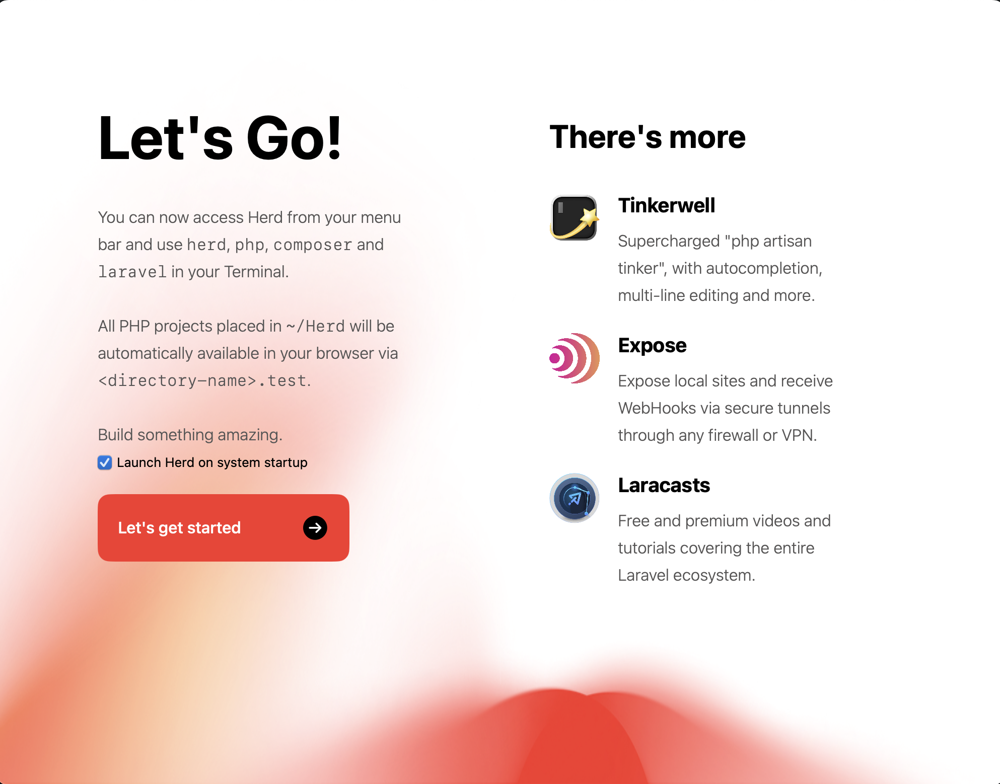
- Bekijk de settings van Herd.
    - [WINDOWS] Open Herd dashboard
        - In je system system tray (rechtsonderin) zie je een icoon van Herd. Klik hierop.
        - Hiermee open je het Herd dashboard.

          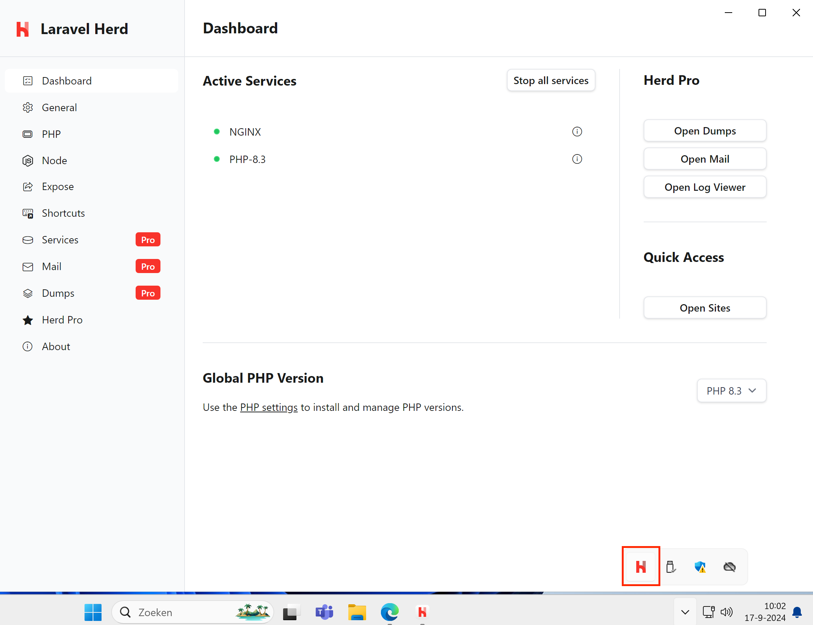
    - [MAC] Open Herd Menu
        - Open het Herd menu via het icoon in de Menu Bar (rechtsboven).

          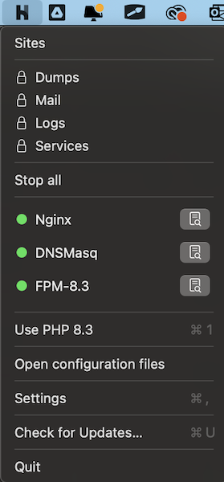

## Configuratie Herd

### Add trailing slash

Om ervoor te zorgen dat de URL's in de browser altijd eindigen met een `/` moet je de volgende stappen doorlopen in Herd:

- Rechtermuisklik op het Herd icoon in de system tray (Windows) of menu bar (Mac).
- Kies voor **configuration files**.
- Dit opent `.config/herd`. [MAC] Dit opent de php map, je moet nu één map omhoog.
- Ga nu naar `config/nginx` en open herd.conf in een teksteditor.
- Boven het onderdeel location voeg je de volgende regel toe.
  ```apacheconf
  rewrite ^([^.]*[^/])$ $1/ permanent;
  ```
- Nu ziet je config er als volgt uit:
  ```apacheconf
    server {
    listen 127.0.0.1:80 default_server;
    #listen VALET_LOOPBACK:80; # valet loopback
    root /;
    charset utf-8;
    client_max_body_size 128M;

    rewrite ^([^.]*[^/])$ $1/ permanent;
  
    location ~* /41c270e4-5535-4daa-b23e-c269744c2f45/([A-Z]+:)(.*) {
        internal;
        alias $1;
        try_files $2 $2/;
    }
   ```
- Sla het bestand op en sluit het.
- Wederom rechtermuisklik op het Herd icoon in de system tray (Windows) of menu bar (Mac) en kies voor
  **Stop all services** en vervolgens **Start all services**.

### Site tonen zonder geschikte driver

Om alle zelfgemaakte site kunnen zien in het overzicht van **Sites** in Herd, moet je de volgende
optie aanzetten.

- In het dashboard van Herd ga je naar **Sites**
- Klik op settings (het tandwiel icoon).
  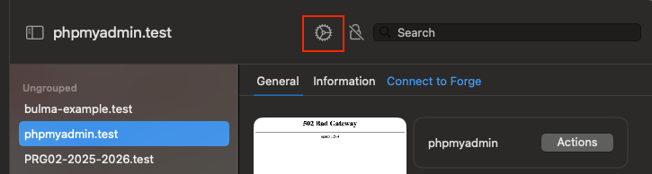
- Selecteer de optie **Show sites without valid driver**
  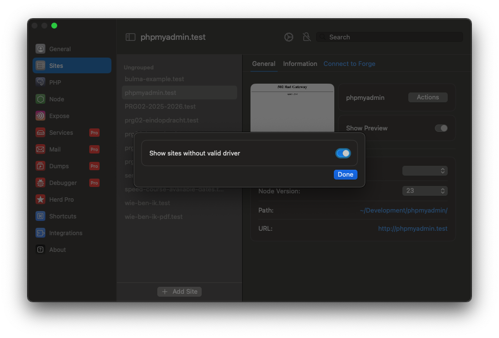


### Directory listing aanzetten

Om straks makkelijk naar bestanden te kunnen navigeren in de browser zetten we **directory listing** aan.  Vanwege
veiligheidsoverwegingen staat **directory listing** standaard uit.

- **Open Powershell** (**Terminal** op Mac).
- Voer het volgende commando uit
  ```bash
  herd directory-listing on
  ```

## Jetbrains Toolbox

- Dubbelklik de installer en volg de stappen.
- Als de Jetbrains Toolbox helemaal geïnstalleerd is, kun je inloggen met je Jetbrains account.
  Open de toolbox en klik op het icoontje rechtsboven in de hoek en klik op _Log in_.

  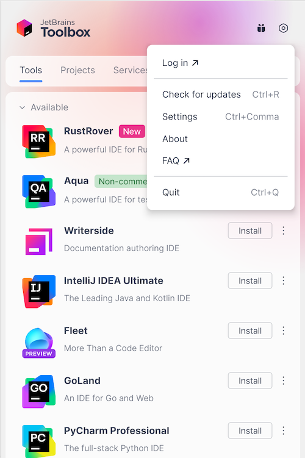

  Via de browser kun je nu inloggen met het Jetbrains Account dat je zojuist hebt aangemaakt.

## PhpStorm

- Open de Jetbrains Toolbox (System tray) en zoek naar PhpStorm.
- Klik op _Install_ en wacht tot de installatie is voltooid.
- Open PhpStorm vanuit de toolbox.
- Geef toestemming voor netwerken.
- Je kunt Jetbrains eventueel helpen door anonieme statistieken te delen.

### Configuratie PHPStorm

Als je in phpStorm werkt zitten er enorm veel toffe features, snelkoppelingen, etc waar we ook regelmatig bij stilstaan.
Er zijn echter ook 3 settings die standaard niet ideaal ingesteld zijn, en we raden je aan deze aan te passen als volgt:

1. **Zet de inline completion uit.**

   Daarmee voorkom je auto suggestions die, net als een AI agent, je op het huidige moment in je carrière eerder tegenwerken dan helpen. Het nu zelf leren en later in je carrière deze feature aanzetten is uiteraard een logische vervolgstap. Maar fouten krijgen na autocompletion zonder dat je nog goed weet wat het doet, werkt jezelf alleen maar tegen.
- Ga naar *settings* (WINDOWS file > setting, MAC PhpStorm > settings) en zoek daar in de zoekbalk op *inline completions*. Zet deze uit.
  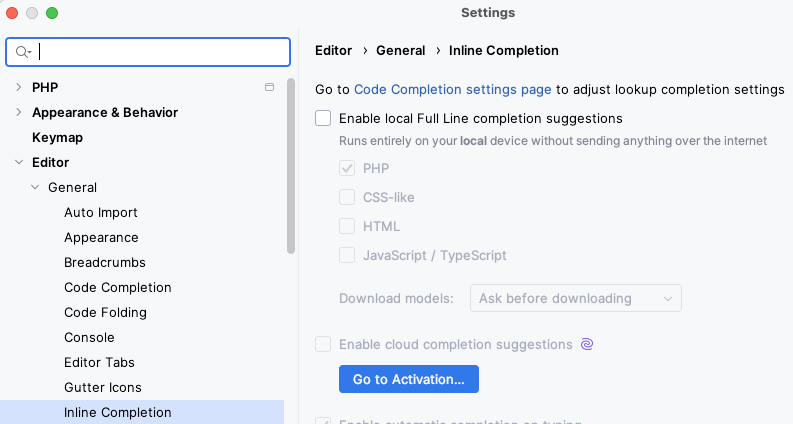

2. **Zet commit tool aan.**

   Daarmee krijg je, als je gaat committen, een popup waar je beter overzicht hebt over wat je gaat committen.
   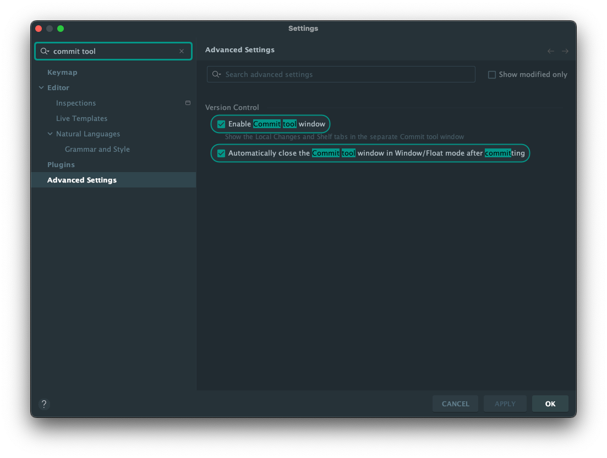

3. **Zet ook het vinkje "clear initial message" aan**

   Hiermee wordt je altijd geforceerd om een nieuw bericht te typen voordat je commit.
   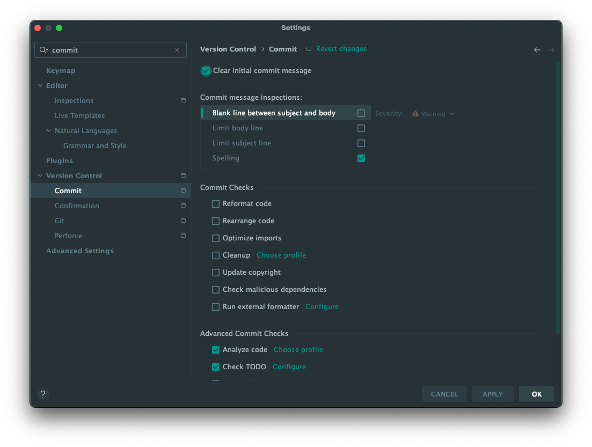

- In de popup (**wanneer je gaat committen, dat is nu nog niet**) kun je ook gemakkelijk de vinkjes voor "analyze code" en "check todo" uitzetten waardoor je geen ellenlange warnings krijgt bij een commit.

  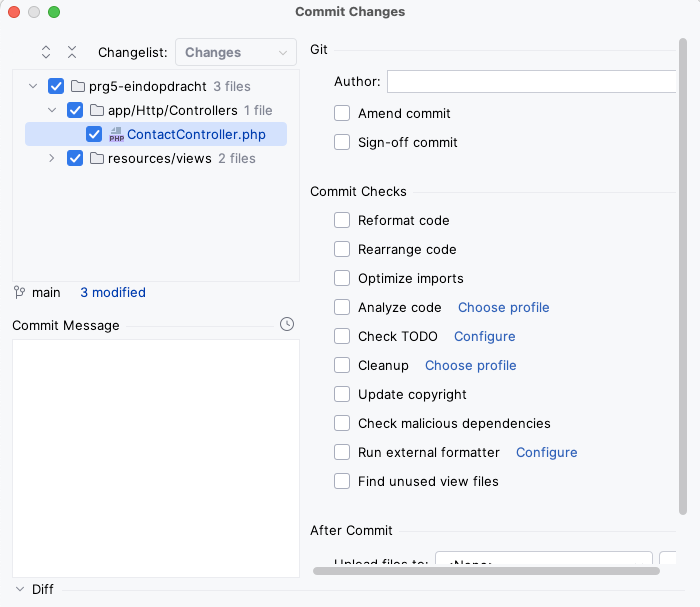
- We zien nog regelmatig niet mooi geformatte code voorbij komen. Als je zoekende bent in code kan dit je tegenwerken.
  Door het vinkje "reformat code" aan te zetten bij "actions on save" wordt je code bij het opslaan automatisch geformat en weer netjes uitgelijnd. Lang leve leesbaarheid

  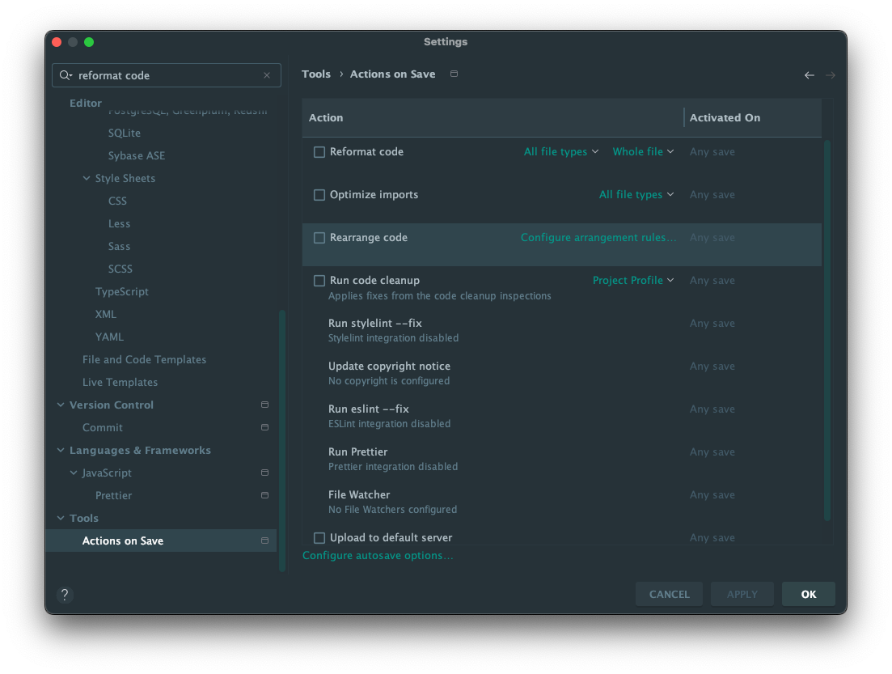

### AI assistant

Wanneer je vragen wilt stellen aan AI doe je dat in de **'Ask mode'**. Wanneer je de agent gebruikt zullen denkstappen voor je gedaan worden wat jouw ontwikkeling in de weg zit.

Als je een vraag wilt stellen, dan kun je dit het beste in Copilot doen. Daar heb je een keuze uit modellen en zit je niet vast aan het freemium model dat de Jetbrains AI assistant standaard biedt.

**Jetbrains AI Assistant uitzetten.**
- Ga naar de settings van PhpStorm en zoek op **'assistant'**
- Klik in de sidebar op **Plugins** en bovenin het scherm op **Marketplace**
- In de zoekbalk zoek je op **'Jetbrains assistant'**
- Klik op het pijltje naast Disable en kies voor **uninstall**.

  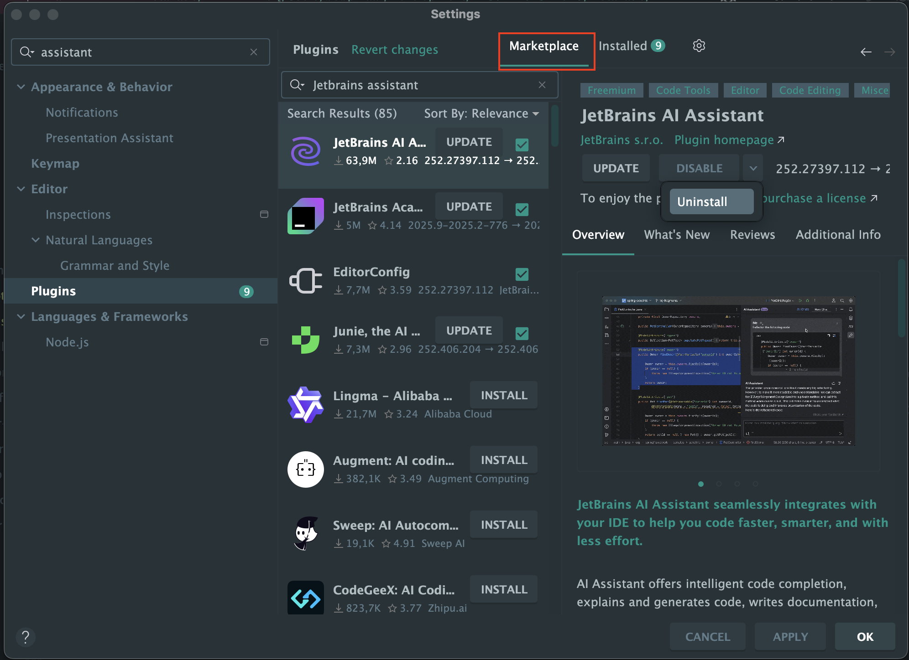
- In de rechtbovenhoek klik je met rechtermuis op het assistant icoon en kies je **Hide**.

  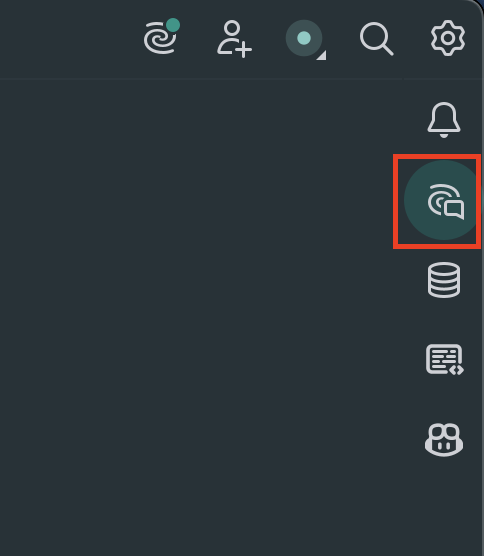

**Github Copilot aanzetten.**
- Zoek nu in de zoekbalk op **'Github Copilot'**
- Klik op Enable
- Je zal hierna PhpStorm moeten herstarten.

  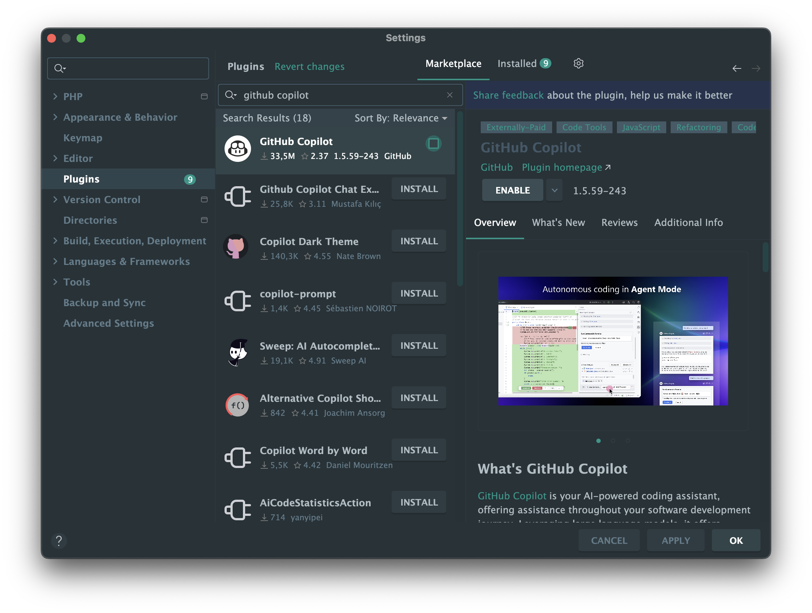

### Test de server met eigen PHP-bestand

Om te testen of de server werkt voegen we een `serverinfo` map toe aan de Development map. Hierin komt een
bestand `phpinfo.php` te staan. Dit bestand geeft informatie over de PHP-instellingen van de server.

- Open de **Development** map in explorer/finder. (Bijvoorbeeld `C:\Users\[USER ACCOUNT]\Development`) en voeg de
  map `serverinfo` toe.
- Open PhpStorm en open de map `serverinfo`.
- Kies voor _Trust Project_ (en vink aan dat je voortaan alle projects in de Development map vertrouwt).
- Aan de linkerkant zie je een icoontje van een map om de mappenstructuur te zien. Klik hierop als deze nog niet
  zichtbaar is.
- Rechtermuisklik op de hoofdmap _serverinfo_ en kies voor _New > PHP File_
- Geef het bestand de naam `phpinfo.php`
- Typ in dit bestand
  ```php
  <?php 
  phpinfo();
  ```
Dit bestand ga je nu in de browser bezoeken.
- Klik met de rechtermuisknop op **Herd** in de system tray en kies voor _Open Sites_.
- Waarschijnlijk moet je eerst op verversen klikken om de site te zien. Klik hiervoor op het icoontje met de twee pijltjes.
- Je ziet nu de site `serverinfo.test` staan. Klik hierop.
- De details van de site worden getoond. In de gegevens zie je URL staan, met de link naar de site.
  [http://serverinfo.test](http://serverinfo.test). Klik hierop.
- Je ziet nu de volgende pagina. Klik op de link naar het bestand `phpinfo.php`.
    <div style="background-color: white; font-family: 'Times New Roman',serif; color: black;">
    <h1>Index of /</h1>
    <hr/>
    <a href="http://serverinfo.test/phpinfo.php" style="text-decoration: underline; color: #0000EE;">/phpinfo.php</a>
    </div>
    <br>

- Je ziet nu een pagina met informatie over de PHP-instellingen van de server.
- 🎉 Gefeliciteerd! Je hebt nu een werkende webserver en IDE.

⚠️ Wanneer je het bestand (`phpinfo.php`) gebruikt op een live-server om informatie over de server te krijgen, is het
verstandig om het bestand, na het inzien van de informatie, direct te verwijderen. Het geeft namelijk veel informatie
over de server en kan een veiligheidsrisico vormen.

## DBngin

- Dubbelklik de installer en volg de stappen. Laat de standaard opties staan.
- Na het starten van de applicatie vink je bovenin de twee opties aan:
    - _Start on login_
    - _Show in taskbar_

### Databaseserver toevoegen

Als eerste gaan we een nieuwe MySQL server toevoegen, om vervolgens een database aan te kunnen maken.
- Klik op het `+`-teken om een database toe te voegen. En kies voor MySQL.

  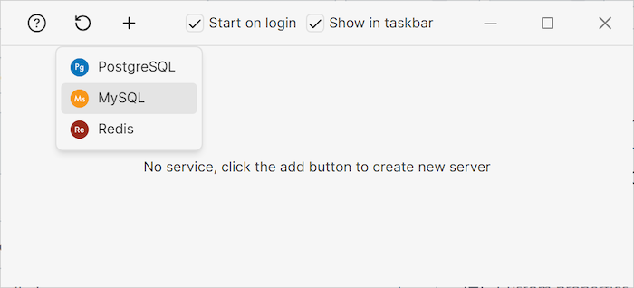
- In het volgende overzicht pas je de volgende dingen aan.
    - Version: 8.4
    - Name: MySQL
    - vinkje voor _Automatically start service on Login_.

  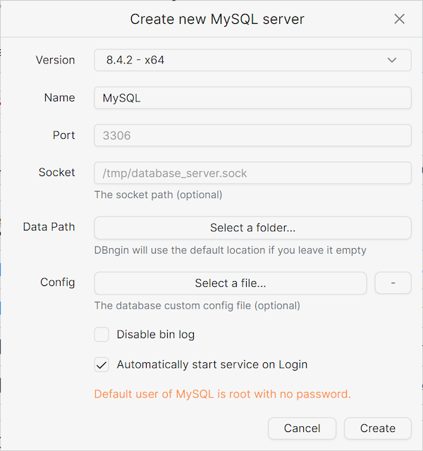
  <br>Let op! Zoals aangegeven in de afbeelding (oranje letters), zijn de default credentials om te verbinden met de server:
    - **Username**: root
    - **Password**: _leeg laten_

- Klik op _Create_ en vervolgens op _OK_ om een admin toe te voegen.
- Geef toestemming voor de toegang tot netwerken.
- De server is nu toegevoegd aan het beginscherm van DBngin. Klik op start om de server te starten. In de toekomst zal
  na een herstart van de computer de server automatisch starten.
  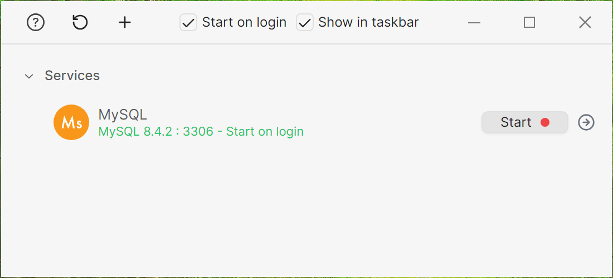

### PHPMyAdmin toevoegen

Om makkelijk bij een database te kunnen om bijvoorbeeld een nieuwe database aan te maken, de inhoud van een tabel te
kunnen zien of om data te bewerken (admin taak) kun je gebruik maken van een database management tool. Deze bestaan in
desktop variant, het zit ook ingebouwd in PHPStorm, maar een veelgebruikte variant is via een Webomgeving. PHPMyAdmin
is een veel gebruikte toepassing. Om PHPMyAdmin te kunnen gebruiken doe je het volgende:

- Download [PHPMyAdmin](https://www.phpmyadmin.net/downloads/). Je kunt de ZIP-file van de Engelse versie downloaden.
- Open de `Development` map in de Finder/Explorer en sleep de ZIP-file naar deze map.
- Pak de ZIP-file uit en hernoem de map naar `phpmyadmin`.
- In de map `phpmyadmin` staat een bestand `config.sample.inc.php`. Hernoem dit bestand naar `config.inc.php`.
- Open het bestand in een teksteditor en zoek naar de regel `$cfg[‘Servers’][$i][‘AllowNoPassword’]`.
  Verander de waarde van `false` naar `true`.
- Verander ook de host naar `127.0.0.1`
  ```php
  $cfg['Servers'][$i]['host'] = '127.0.0.1';
  ...
  $cfg['Servers'][$i]['AllowNoPassword'] = true;
  ```
- Sla het bestand op en sluit het.
- Via de browser kun je nu PHPMyAdmin openen door naar `phpmyadmin.test` te gaan.
  Of via de Sites in Herd (wel even verversen).

--------------------

# PHP Projecten

In de **Development** map gaan we drie projecten maken. Het eerste project komt van GitHub en dat is het project met
alle **lesopdrachten** en voorbeelden. Het tweede project is de **werkmap** waarin je alle lesopdrachten
uitwerkt. Het laatste project is het project met de **eindopdracht**. Hierin komt de website te staan die je deze cursus
gaat maken en die je aan het einde van de cursus inlevert als eindopdracht.

Dit zijn losse projecten die je ook los opent in PHPStorm. Je hebt straks dus drie projecten openstaan in PHPStorm in
drie verschillende vensters.

## Lesopdrachten

- Ga naar de [GitHubpagina](https://GitHub.com/HR-CMGT) van CMGT en dan specifiek de [repository
  van Programmeren 2](https://GitHub.com/HR-CMGT/PRG02-2024-2025)
- Hier zie je een groene knop met de tekst **Code**. Klik hierop en kopieer de `https` link die je ziet staan.
- Ga nu naar PHPStorm en kies voor _Clone Repository_.

  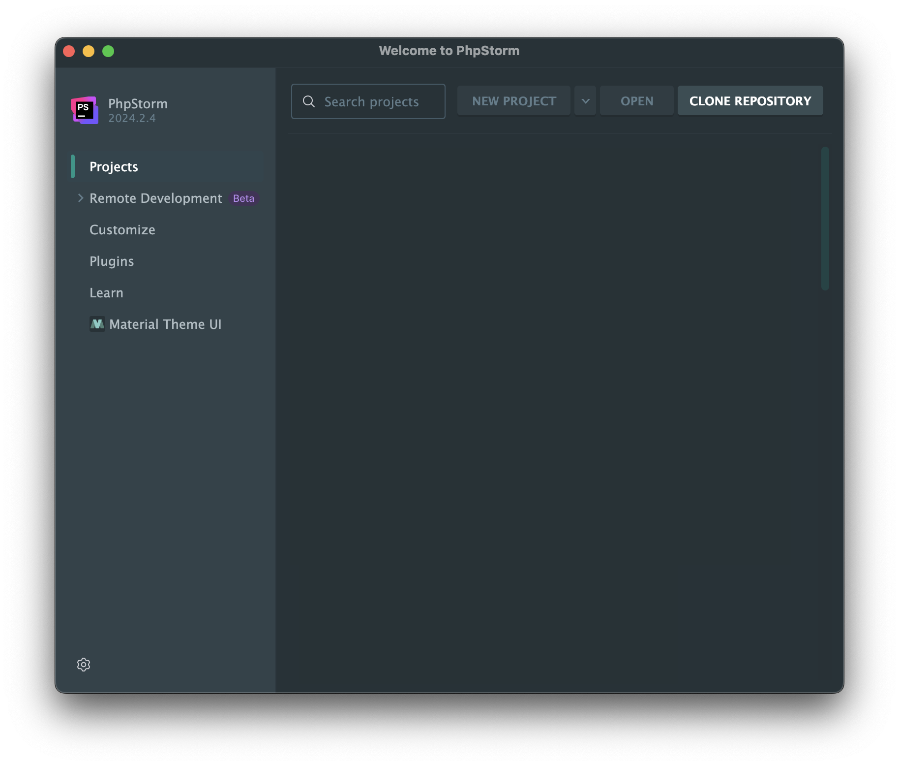
- Plak de link van GitHub bij url en bij Directory navigeer je naar de **Development** map.
- Achter **Development** geef je de map de naam `prg02-lesopdrachten` en klik je op _Clone_.

  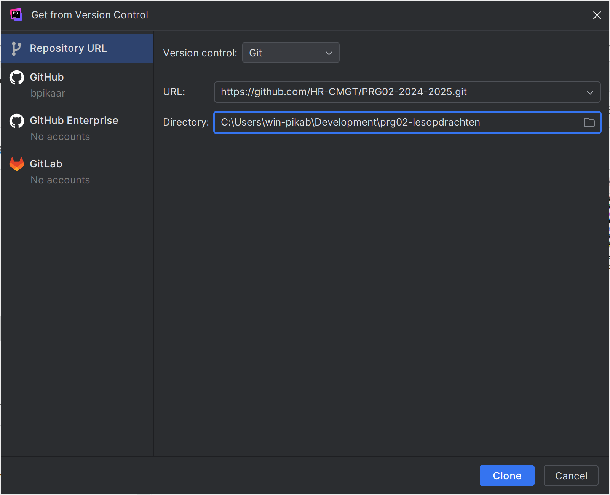
- Login met GitHub via de browser
- Wil je de PHP-bestanden inzien dan open je de map `prg02-lesopdrachten` in PhpStorm.
- Je kunt het resultaat ook bekijken in de browser. Open en ververs de Sites in Herd en klik op de
  site `prg02-lesopdrachten.test`. Je kunt natuurlijk ook direct naar `prg02-lesopdrachten.test` in de browser gaan.

## Werkmap

- Maak een nieuwe map aan in de **Development** map en noem deze `prg02-werkmap`
- Wanneer je aan de lesopdrachten gaat werken, kopieer je de map van de les naar deze map.
  Zo kun je de lesopdrachten uitwerken zonder dat je de originele lesopdrachten aanpast.
- In PHPStorm ga je naar _File > Open_ en navigeer je naar de map `prg02-werkmap`.
- Open het project in een **nieuw venster**.

## Eindopdracht

- Ga in PhpStorm naar _File > New Project_
- Kies voor empty PHP Project.
- Geef de map de naam `prg02-eindopdracht`.
- En plaats deze in de **Development** map.

  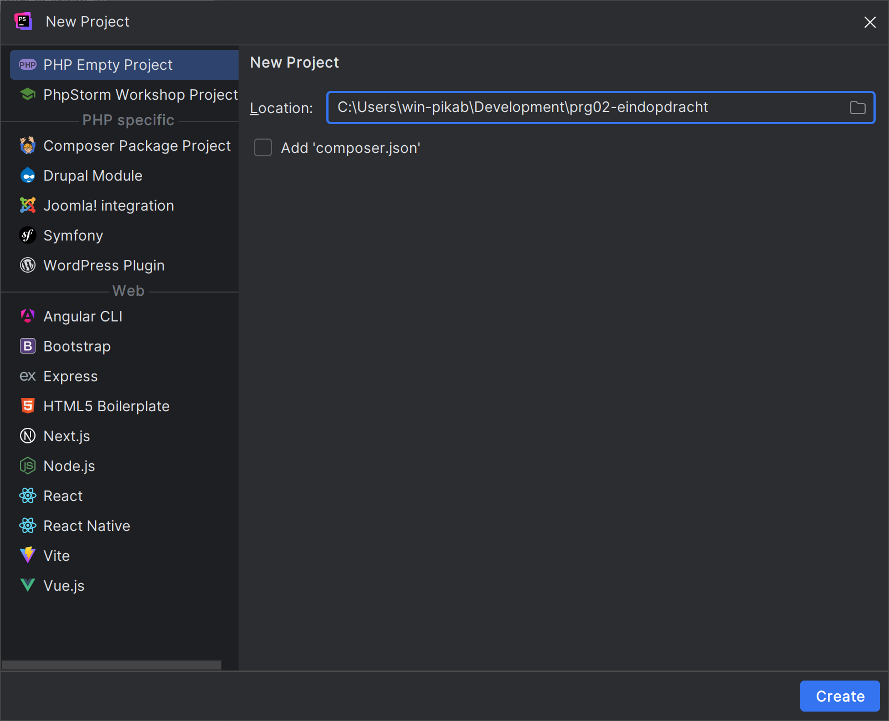
- Klik op Create en je ziet nu een lege map met de naam eindopdracht.

**Toevoegen aan GitHub**

Om ervoor te zorgen dat jouw project veilig is opgeslagen, voeg je deze toe aan GitHub. Doe dit voor het project
met de eindopdracht. Je kunt dit ook doen voor de werkmap.

- Als het project open staat, klik je op _VCS > Share Project on GitHub_
- Eventueel moet je hierna inloggen met je GitHub account.
- Klik op Share en je project wordt geüpload naar GitHub.

## [OPTIONEEL] GitHub Student Developer Pack

Als onderdeel van de GitHub Student Pack heb je toegang tot allerlei gratis diensten, waaronder een gratis
account op GitHub Pro. Hiermee kun je onbeperkt private repositories aanmaken. $200 aan gratis tegoed op
Digital Ocean voor cloud hosting, een jaar lang gratis domeinnaam registratie op Namecheap en nog veel meer.

- Om toegang te krijgen tot deze diensten, ga je naar [https://education.GitHub.com/pack](https://education.GitHub.com/pack)
- Klik op _Get student benefits_
- Kies voor _Student_
- En gebruik het e-mailadres van de Hogeschool Rotterdam als je het account aanmaakt.

### Domeinnaam

Via the student pack kan je bij namecheap een domeinnaam (.me) registreren.
- https://www.namecheap.com/support/knowledgebase/article.aspx/9687/35/how-to-register-a-domain-via-our-educational-promotion-at-ncme/?hcs_request_id=e0f2bffb47e4

### Cloud Hosting

Nadat je je hebt aangemeld voor het Student Developer Pack, kun je een gratis account aanmaken op Digital Ocean.

- Ga naar [https://www.digitalocean.com/github-students](https://www.digitalocean.com/github-students)
- Klik op _Git Started_
- Log in met je GitHub account (gebruik de knop _Sign up with GitHub_)
- _Authenticate with GitHub_ en geef Digital Ocean toegang om je e-mailadres uit te lezen.
- Je hebt nu je eigen cloud hosting account.
- Deze kun je bezoeken via [https://cloud.digitalocean.com](https://cloud.digitalocean.com)